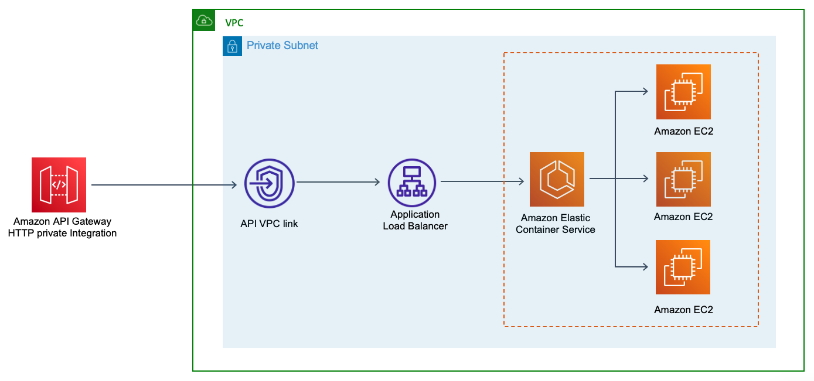
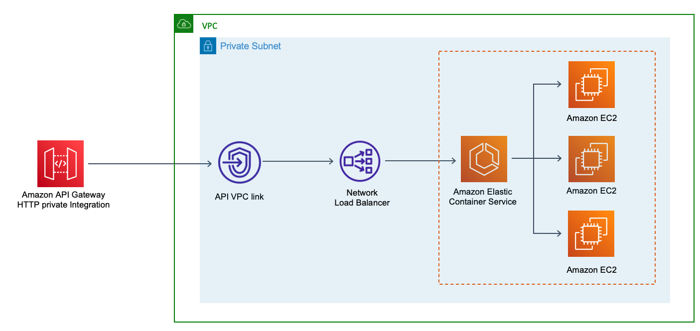
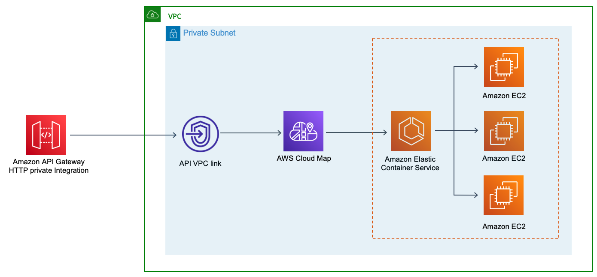

# Configuring private integrations with Amazon API Gateway HTTP APIs

The following provides AWS CloudFormation [templates](https://github.com/aws-samples/aws-apigw-http-api-private--integrations/tree/main/templates) to three [Amazon API Gateway HTTP private integration](https://docs.aws.amazon.com/apigateway/latest/developerguide/http-api-develop-integrations-private.html) configurations using either an [Application Load Balancer](https://docs.aws.amazon.com/elasticloadbalancing/latest/application/introduction.html) (ALB), [Network Load Balancer](https://docs.aws.amazon.com/elasticloadbalancing/latest/network/introduction.html) (NLB) or [AWS Cloud Map](https://aws.amazon.com/cloud-map/).  

A [HTTP API](https://docs.aws.amazon.com/apigateway/latest/developerguide/http-api.html) route receives a request and uses a [VPC Link](https://docs.aws.amazon.com/apigateway/latest/developerguide/http-api-vpc-links.html) to encapsulate connections between Amazon API Gateway and its targeted VPC resources. When a VPC link is created, Amazon API Gateway creates and manages the [elastic network interfaces](https://docs.aws.amazon.com/AWSEC2/latest/UserGuide/using-eni.html) for the VPC link in your account. All three HTTP API private integration methods only allow access via a VPC link to targets on an [Amazon ECS](https://aws.amazon.com/ecs) cluster.

Each [template](https://github.com/aws-samples/aws-apigw-http-api-private--integrations/tree/main/templates) deploys:  
- A base VPC with Public and Private Subnets across 3 Availability Zones.  
- Internet and NAT gateways.  
- Amazon ECS cluster with resources on underlying EC2 instances in Private Subnets.  
- API Gateway VPC link.
- HTTP API with integration to either an ALB, NLB or AWS Cloud Map.

### [1.Application Load Balancer.](https://github.com/aws-samples/aws-apigw-http-api-private--integrations/blob/main/templates/APIGW-HTTP-private-integration-ALB-ecs.yml)

### [2.Network Load Balancer.](https://github.com/aws-samples/aws-apigw-http-api-private--integrations/blob/main/templates/APIGW-HTTP-private-integration-NLB-ecs.yml)

### [3.AWS Cloud Map.](https://github.com/aws-samples/aws-apigw-http-api-private--integrations/blob/main/templates/APIGW-HTTP-private-integration-AWS-Cloudmap-ecs.yml)

- - -
### Getting Started - Pre-requisites.
**NOTE:** By default your account will only have **five** elastic IP addresses unless you have requested an increase. As this demo deploys **three** NAT Gateways, therefore, **three** elastic IP addresses must be available.  

Each template presumes you have already created an [ECR Image](https://docs.aws.amazon.com/AmazonECR/latest/userguide/what-is-ecr.html) which is accessible from your account and region. This is required as an initial input parameter. If not, then [install docker](https://docs.aws.amazon.com/AmazonECS/latest/developerguide/docker-basics.html) and create a [docker image](https://docs.aws.amazon.com/AmazonECS/latest/developerguide/docker-basics.html#docker-basics-create-image) of a simple http web application listening on port 80. Then [push](https://docs.aws.amazon.com/AmazonECS/latest/developerguide/docker-basics.html#use-ecr) your image to Amazon Elastic Container Registry (ECR).  

- - -
### Deployment.
1-Download a CloudFormation template from the [GitHub repository.](https://github.com/aws-samples/aws-apigw-http-api-private--integrations/tree/main/templates)

2-From your AWS console, navigate to CloudFormation.

3-Create stack, select *With new resources (standard)*.

4-Select upload template, then Choose file.

5-Under Specify stack details provide a unique stack name.

6-After you provide your ECR Image URI, either leave the below default Parameters, or adjust depending on your requirement.

- InstanceType: Class of EC2 instance used to host containers. Choose t2 for testing, m5 for general purpose, c5 for CPU intensive services, and r5 for memory intensive services.

- DesiredCapacity: Number of EC2 instances to launch in your ECS cluster.

- MaxSize: Maximum number of EC2 instances that can be launched in your ECS cluster.

- ECSAMI: The Amazon Machine Image ID used for the cluster, leave it as the default value to get the latest AMI.

- ECRImage: Your Amazon ECR Image URI - example: **111122223333.dkr.ecr.eu-west-2.amazonaws.com/demo-app:latest**

- NumberOfTasks: The Number or ECS task to be deployed into your ECS Cluster.

7-Next.

8-For this demo only, you can then accept the defaults for Configure stack options and Advanced options.

9-Next.

10-Finally, before you create the stack, please remember to tick - "I acknowledge that AWS CloudFormation might create IAM resources."  

- - -
### Note: 
Please allow **a few minutes** after deployment for load balancers to register with their targets, this may take slightly longer with an Network Load Balancer.
Also, it may take **a few minutes** for [ECS service discovery](https://docs.aws.amazon.com/AmazonECS/latest/developerguide/service-discovery.html) to register with AWS Cloud Map and for [Amazon Route 53](https://aws.amazon.com/route53/) to create a [namespace](https://docs.aws.amazon.com/cloud-map/latest/dg/working-with-namespaces.html) for your service.  

- - -
### Output. 
Once deployed, an API Gateway Invoke URL can be found within the Outputs tab in AWS Cloudformation.  

- - -
### License Summary.
This sample code is made available under the MIT-0 license. See the [LICENSE file.](https://github.com/aws-samples/aws-apigw-http-api-private--integrations/blob/main/LICENSE)  

- - -
